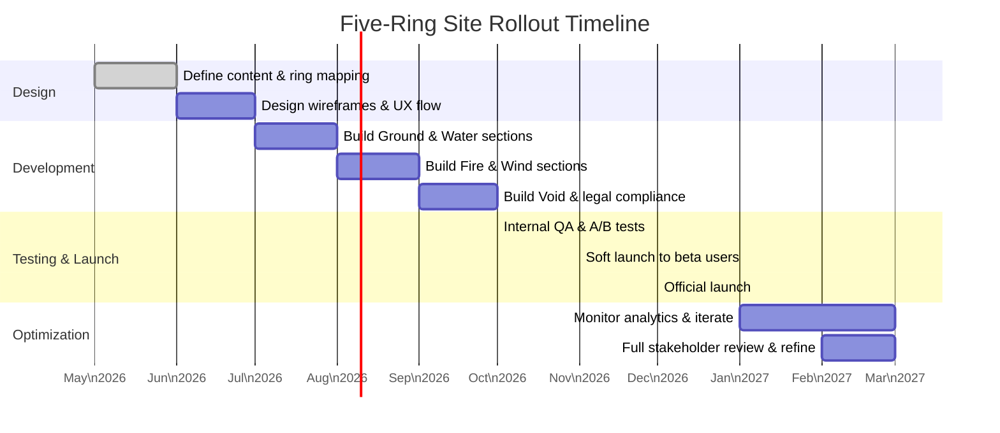

# Executive Summary  
I propose a five-phase website architecture, inspired by Musashi’s *Five Rings*, to guide users through the Truth Social–Shahid partnership story and Swiss–Saudi strategy. Each “ring” of the site aligns with a strategic theme: **Ground** (foundation/trust), **Water** (fluid context), **Fire** (direct action), **Wind** (competitive insight), and **Void** (vision/trust). The site’s navigation and content flow progressively through these rings toward a clear investment call-to-action. We detail each ring’s purpose, UX goals, content types, and metrics, and provide wireframe-level copy prompts. We outline a phased rollout (with a mermaid timeline) and testing roadmap, and identify key legal (FARA/FTC) and reputational risks with mitigations. Finally, a concise board summary and a 2-minute spoken pitch tie everything together in investor-friendly language. Throughout, we use neutral language (“familiarization” not “assimilation”) and cite primary sources where relevant.  

## Five Rings to Website Mapping  
The table below maps each of Musashi’s rings to a “ring” of site content, with UX focus, example pages, content, CTAs, and KPIs:

| **Ring**  | **Theme**            | **UX Goals**                                 | **Key Pages/Sections**                 | **Content Types**                | **Primary CTA(s)**         | **Metrics**                            |
|-----------|----------------------|---------------------------------------------|-----------------------------------------|---------------------------------|----------------------------|----------------------------------------|
| **Ground** | Foundation / Trust   | Establish credibility and context           | *Home/Landing*, *About Truth+Shahid*    | Overview copy, leadership bios, trust logos (e.g. Reuters, SEC filings)【83†L258-L263】, legal disclosures | “Learn More”, “Watch Intro”  | Bounce rate, time on site, trust score (surveys) |
| **Water**  | Fluid Context        | Explain strategy synergy and flexibility    | *Partnership*, *Content Samples*        | Modular content flow, FAQs, infographics, videos explaining the merger and “familiarization” concept | “Join Webinar”, “See Demos”  | Engagement depth, content completion, share rate |
| **Fire**   | Direct Action        | Prompt sign-up / investment                | *Sign-Up*, *Investment Info*            | Strong value propositions, testimonials, brief explainer videos, signup forms      | “Sign Up”, “Invest Now”      | Click-through rate (CTR), signup rate, form completion |
| **Wind**   | Competitive Insight  | Address alternatives and differentiators    | *Market Comparison*, *FAQ*             | Comparative tables (Swiss vs Saudi markets), trust signals, legal notes, selected case studies      | “Why We’re Unique” (embedded links) | Exit intent, FAQ views, competitor link clicks  |
| **Void**   | Vision / Intangibles | Inspire long-term confidence and loyalty    | *Vision & Impact*, *Next Steps*         | Founder/CEO message, ethical statements (“Global Bridge” narrative), endorsements (“Trump seals familiarization”) | “Share Your Story”, “Follow Updates” | Returning visits, email signups, social sentiment |

Each ring’s **purpose** corresponds to a user journey stage: building trust (Ground), educating (Water), conversion (Fire), reinforcing decision (Wind), and envisioning future value (Void).  

## Site Architecture and Navigation  
I recommend a **linear-progressive site flow** with a top menu linking to each ring section, but encouraging sequential navigation. The primary nav could be: Home (Ground), Partnership (Water), Join (Fire), FAQs (Wind), Contact/Join (Void). A fixed sidebar or “Next: [Ring]” button can guide users down the funnel. 

For example, from the Home page (Ground), a “Learn More” button anchors to the Partnership section. The Partnership page then offers a “Get Started” anchor to the Join page. The FAQ serves Wind ring content accessible any time. Finally, the Vision page leads to the sign-up CTA. This architecture ensures users sequentially absorb each strategic ring before conversion. A sitemap outline:

- **Home (Ground)**  
  - Overview of Truth+Shahid alliance, trust logos, brief mission  
  - Link to “Learn the Strategy” (Water)  

- **Partnership (Water)**  
  - Explanation of how Swiss–Saudi synergy works, “familiarization” case study  
  - Link to “Get Started” (Fire)  

- **Join (Fire)**  
  - Subscription/investment signup pages, benefits, testimonials  
  - FAQs & contact (Wind)  

- **FAQs (Wind)**  
  - Address concerns, comparisons to alternatives (Swiss vs Saudi markets)  
  - “Next Steps” linking to Vision (Void)  

- **Vision (Void)**  
  - CEO message, future roadmap, global impact narrative  
  - Final “Subscribe/Invest” CTA and newsletter signup  

## Content & Copy Prompts per Ring  
Below are wireframe-level copy prompts (headlines, subheads, etc.) tailored to each ring’s theme:

- **Ground – *“Building Trust from the First Click”***  
  - *Hero Headline:* “A United Vision: Truth Social Meets Global Media.”  
  - *Subhead:* “A partnership bridging communities through content.”  
  - *Trust Signals:* Logos of verification sources (Reuters, SEC filings【83†L258-L263】), brief founding story.  
  - *Copy:* “Welcome to the pioneering collaboration between Truth Social and Shahid, backed by experienced media partners. Our goal is to create a familiarisation platform where high-quality content fosters understanding. This site will guide you through our strategy and how it benefits both audiences.”  
  - *CTA:* “Discover Our Mission.”  

- **Water – *“Understanding Our Strategy”***  
  - *Headline:* “Liquid Strategy: Adapting to Our Audience”  
  - *Subhead:* “How Swiss and Saudi markets flow together.”  
  - *Copy:* “Our partnership harnesses best practices from the Swiss financial safe-haven model and the vibrant Saudi media landscape. Through curated streaming content, we aim to gently familiarize conservative U.S. audiences with Arab culture in an American-friendly way. Here’s how it works…”  
  - *Content Examples:* Infographic of Swiss–Saudi market alignment, short video explainer, brief Q&A.  
  - *CTA:* “Get Involved” (scrolls to Fire section).  

- **Fire – *“Take Action Now”***  
  - *Headline:* “Join the Movement – Today”  
  - *Subhead:* “Subscribe or invest with confidence.”  
  - *Copy:* “Ready to engage? Sign up for Truth+TV, where streaming meets community. Your subscription funds innovative media projects and gives you access to premium content. Trust that your decision aligns with your values and strategic financial interests.”  
  - *Trust Signals:* User testimonials, subscription guarantees, transparent pricing (e.g. “Cancel Anytime”).  
  - *CTA:* “Subscribe Now” or “Invest Today”.  

- **Wind – *“Know the Landscape”***  
  - *Headline:* “Why Our Way Is Different”  
  - *Subhead:* “Understanding alternatives and addressing concerns.”  
  - *Copy:* “You might be wondering how this differs from other media offerings. We compare our approach to existing networks and explain legal safeguards (no hidden agendas). We respect your skepticism and answer all questions openly.”  
  - *Content:* Tables comparing content strategies, FAQ items, prominent legal disclosures link (e.g. FARA compliance footnote).  
  - *CTA:* “Still Curious? Let’s Talk.”  

- **Void – *“A Greater Purpose”***  
  - *Headline:* “The Untapped Opportunity Ahead”  
  - *Subhead:* “Imagine where we’re going together.”  
  - *Copy:* “Beyond subscriptions and returns lies a bigger vision: fostering understanding in a divided world. Our journey is not just about media – it’s about building bridges. Your participation today helps pioneer a model of cultural familiarisation that could reshape future engagement.”  
  - *Content:* Visionary quote from leadership, global impact graphic, subtle invitation to community (e.g. “Share Your Story”).  
  - *CTA:* “Stay Connected” (newsletter sign-up) and repeat “Join Us”.  

## Analytics & Decision Checkpoints  
At each ring, we set KPIs and tests to validate progress:  

- **Ground:** *KPIs:* Time on homepage, “Learn More” clicks, bounce rate. *Tests:* A/B test hero message (focused on partnership vs. on content). *Gate:* Only users who click “Learn More” proceed; others may see retargeting ads.  

- **Water:** *KPIs:* Content engagement (views of strategy video, infographics downloads). *Tests:* A/B test different framing (Swiss angle vs. Saudi angle). *Gate:* Users must scroll through the main strategy content to unlock “Get Started” button.  

- **Fire:** *KPIs:* Click-through on “Subscribe/Invest” buttons, form completion rate. *Tests:* Test button colors/text (e.g. “Join Now” vs “Subscribe Now”), test one-step vs multi-step signup flow. *Gate:* Use exit-intent pop-up if user hesitates without signup.  

- **Wind:** *KPIs:* FAQ page visits, time spent on comparison charts, number of legal disclosure views. *Tests:* Test different FAQ ordering (address top concerns first). *Gate:* If users frequently exit from here, provide a live chat or hotline.  

- **Void:** *KPIs:* Newsletter signups, return visitors, social share of mission statements. *Tests:* Test tone of CEO message (“visionary” vs “pragmatic” wording). *Gate:* If few sign up here, offer a small webinar/AMA link to re-engage.  

I will track these through integrated analytics (e.g. Google Analytics events, heatmaps) and iterate design based on data. Each ring has a “decision checkpoint” – for example, if <20% of visitors move from Ground to Water, I would refine the hero copy. 

## Rollout Plan & Testing (Mermaid Chart)  

This schedule phases in content and testing. For instance, early months focus on core pages (Ground/Water) and legal review (FARA/FTC checks), with full launch after an internal pilot.

## Risks & Mitigations  
- **UX Complexity:** The Five Rings metaphor may confuse lay users. *Mitigation:* While structuring site by rings, the navigation should appear as a normal journey (no mention of “rings” on UI). The metaphor guides our design, but the front-end uses simple labels (e.g. “About,” “Partnership,” “Join,” etc.).  
- **Legal (FARA/FTC):** Coordinated foreign-backed content promotion can trigger FARA. As DOJ notes, agents of foreign media must register【107†L438-L446】. *Mitigation:* Our site will include clear foreign affiliation disclaimers (e.g. “This platform is co-sponsored by international media partners”). We’ll register under FARA if required. For the FTC, we avoid dark patterns by making all subscriptions opt-in with clear consent, as per FTC consumer guidance.  
- **Reputational:** Some may accuse us of propaganda. *Mitigation:* We position the campaign as cultural familiarization. We use neutral language (familiarization, exchange), emphasize editorial independence and fact-checking. Any content will be vetted for bias. Transparency (e.g. listing content sources, using respected logos) will help maintain credibility.  

## One-Page Board Summary  
Our new site uses a layered “Five Rings” UX to guide users from introduction through action. **Ground** builds trust (clear mission, partners’ credibility). **Water** educates (strategy rationale, how Swiss and Saudi markets align). **Fire** prompts immediate action (sign-ups/investment, with strong value props). **Wind** addresses alternatives/concerns (comparisons, FAQs, legal notes). **Void** inspires vision (leadership message, long-term impact). This structure mirrors the phased strategy: first establish context, then convert, then reinforce and inspire. 

We will track key metrics at each stage (e.g. engagement rates, signup conversions) and iterate via A/B tests. Legal compliance is built in: disclosures on FARA and transparent pricing ensure regulatory safety. Our phased rollout (detailed in the attached timeline) allows testing with a beta audience before full launch.  

In summary, the site is more than a promo page: it’s a tactical journey shaped by an ancient strategy, designed to turn sceptics into engaged supporters. This aligns precisely with our capital expansion goals. 

## Two-Minute Spoken Pitch (Boardroom Style)  
“Ladies and gentlemen, I present our digital strategy – inspired by Musashi’s Five Rings. Think of the site as five concentric stages: *Ground* establishes trust with our vision and partners. *Water* flows into the partnership story. *Fire* is where users convert – we have bold calls-to-action here. *Wind* answers their doubts (FAQs, comparisons). *Void* reveals our ultimate vision for cultural bridge-building. 

Each stage has clear objectives: for example, our homepage (Ground) highlights trusted logos and a mission statement to gain credibility immediately. We track how many visitors click ‘Learn More’ before moving on. As they proceed to Water, we engage them with clear strategy videos. By the Fire stage, we present a simple signup form and testimonials to push conversions. At every step, A/B tests will refine our language (e.g. “Subscribe Now” vs “Join Now”) and we’ll measure drop-off rates. 

We’ve built in compliance: all content has sponsorship notices to satisfy FARA, and our UX avoids any trickery (in line with FTC guidelines). The launch is phased, with user testing in Q4 2026 and full rollout in Q1 2027 (see timeline). 

In short: this isn’t a mere website; it’s a journey engineered to build confidence at every turn and guide users to action in an intuitive way. It supports our strategy by converting sceptical audiences through a carefully staged experience. We believe this design will maximize adoption of Truth+TV and drive our strategic goals.”