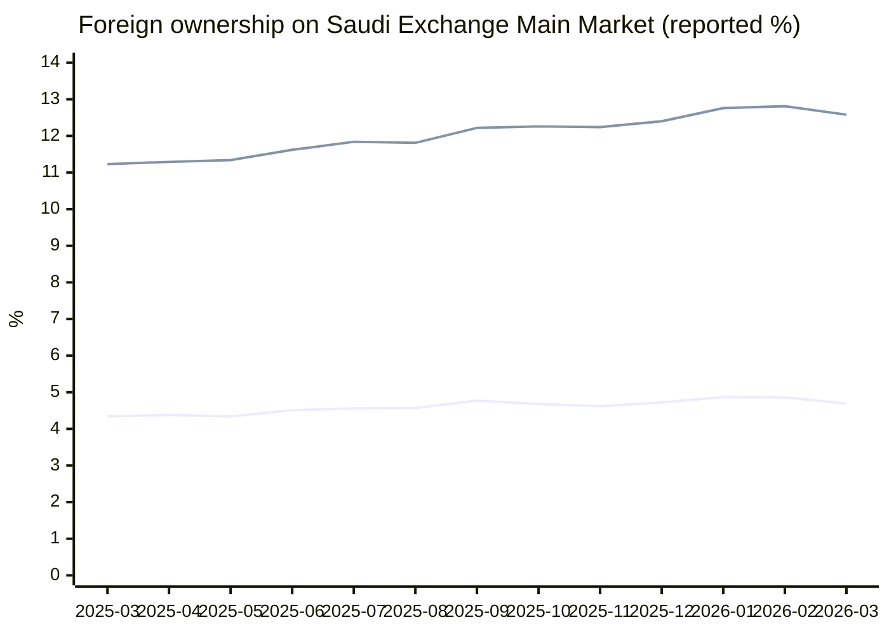
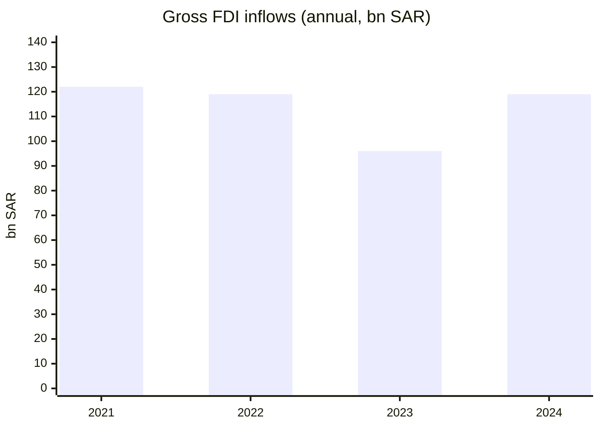
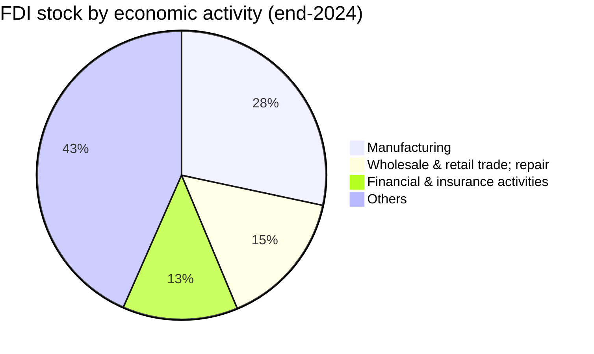
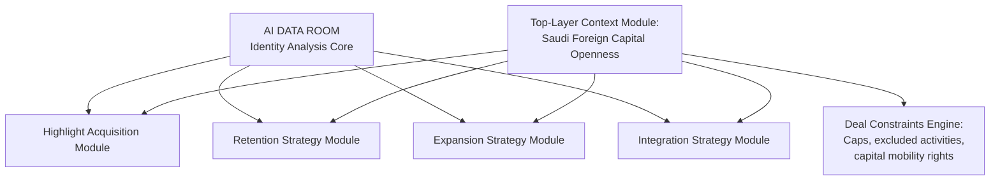

# Saudi Arabia Foreign Capital Openness and Foreign Ownership of Assets

## Executive summary

**Thesis (one sentence):** Saudi Arabia has materially increased foreign capital openness—most visibly by opening its capital market to *all* foreign investor categories from February 2026 and moving the broader investment regime from licensing to registration—while retaining targeted ownership caps and sector/national-security carve‑outs that must be engineered into diligence and deal structure. citeturn28view0turn29view0turn32view0turn32view2

**Key numbers (latest official, dates stated):**
- **FDI stock (inward position):** **SAR 977bn** (end‑2024). citeturn10view3  
- **Annual FDI inflows (gross):** **SAR 119bn** (2024). citeturn10view3  
- **Annual net FDI flows:** **SAR 80bn** (2024). citeturn10view3  
- **Latest quarterly FDI (most recent available):** **Net inflows SAR 48.4bn**; **gross inflows SAR 50.6bn**; **outflows SAR 2.2bn** (**Q4 2025**). citeturn10view0  
- **Saudi Exchange equity market capitalisation (ownership-value basis, Main Market, *excluding corporate actions*):** **SAR 9.713trn** (**as of 26 Mar 2026**). citeturn15view5  
- **Foreign holding value (Main Market):** **SAR 455.5bn** (**as of 26 Mar 2026**). citeturn15view5  
- **Foreign ownership (% of issued shares, Main Market):** **4.69%** (**as of 26 Mar 2026**). citeturn15view5  
- **Foreign ownership (% of free float, Main Market):** **12.58%** (**as of 26 Mar 2026**). citeturn15view5  

**“Outside firms / vehicles” snapshot (Main Market, as of 26 Mar 2026):** the foreign bucket is dominated by **foreign institutions (SAR 379.0bn; 3.90% issued; 11.73% free float)**, plus **foreign strategic investors (SAR 47.1bn; 0.48% issued)**, **foreign DPMs (SAR 16.8bn; 0.17% issued)**, **foreign individuals (SAR 10.5bn; 0.11% issued)**, and **swap holders (SAR 2.1bn; 0.02% issued)**. citeturn15view5  

## Metrics and definitions

**Foreign Direct Investment (FDI).** entity["organization","General Authority for Statistics","saudi statistics agency"] (GASTAT) defines FDI as investment reflecting a long‑term relationship where a foreign investor (individual or group) owns **10% or more** of the voting power/shareholder rights, enabling control or influence. citeturn10view0  

**FDI inflows / outflows / net inflows (quarterly and annual).**
- **Inflows:** financial transactions that *increase* equity and/or debt instruments into the host economy. citeturn10view0  
- **Outflows:** transactions that *reduce* liabilities (e.g., dividends, loan repayment, settlement of dues, investor exits). citeturn10view0  
- **Net inflow:** inflows minus outflows over the period. citeturn10view0  

**FDI stock (inward position).** The annual “FDI stock” is the inward position value at period end. In the 2024 annual publication, GASTAT reports end‑2024 stock and notes the annual indicator is calculated on **register‑based data from the Ministry of Investment**. citeturn10view3  

**Saudi Exchange market capitalisation (reported in ownership reports).** The weekly/monthly nationality ownership reports present **“Holding Value”** totals for the **Main Market** and **Nomu‑Parallel Market**, with a “Grand Total” and a footnote indicating **“excluding corporate actions”**—functionally a market‑value aggregation for that market on the “as of” date. citeturn15view5turn21view1  

**Foreign holding value and ownership percentages (issued vs free float).** The Saudi Exchange ownership tables report foreign investor holding value plus:
- **Issued (%)**: ownership as a percentage of total issued shares (share-count basis). citeturn15view5turn21view1  
- **Free Float (%)**: ownership as a percentage of the free‑float shares. The exchange’s index methodology uses “free float market capitalisation” computed from **closing price × number of free float shares**, grounding the concept of free float shares as the investable share subset. citeturn33search1  

**Data currency/unit conventions used in this report.** All monetary figures are in **Saudi Riyal (SAR)** as published (no FX conversion). Dates use **Gregorian calendar** (YYYY‑MM‑DD). citeturn15view5turn10view3turn10view0  

## Latest official metrics and what they imply

### Comparative table of macro FDI vs listed‑equity foreign ownership

| Dimension | Metric | Value | Date / period | What it measures |
|---|---:|---:|---|---|
| Real-economy foreign capital | FDI stock (inward position) | SAR 977bn | End‑2024 | Accumulated foreign direct investment position |
| Real-economy foreign capital | Annual FDI inflows (gross) | SAR 119bn | 2024 | Inward direct investment transactions (gross) |
| Real-economy foreign capital | Annual net FDI inflows | SAR 80bn | 2024 | Net inward direct investment (inflows − outflows) |
| Real-economy foreign capital | Latest quarterly net FDI inflows | SAR 48.4bn | 2025‑Q4 | Most recent quarterly momentum (net) |
| Listed‑equity foreign capital | Main Market market value (ownership “Grand Total”) | SAR 9.713trn | 2026‑03‑26 | Listed equity market size (Main Market, value aggregation) |
| Listed‑equity foreign capital | Foreign holding value (Main Market) | SAR 455.5bn | 2026‑03‑26 | Market value of foreign‑held positions |
| Listed‑equity foreign capital | Foreign ownership (% issued shares) | 4.69% | 2026‑03‑26 | Foreign ownership on issued‑share basis |
| Listed‑equity foreign capital | Foreign ownership (% free float) | 12.58% | 2026‑03‑26 | Foreign ownership on free‑float basis |

FDI items are from the annual (2024) and quarterly (Q4 2025) FDI publications. citeturn10view3turn10view0 The listed‑equity items are from the Saudi Exchange weekly ownership report (week ending 26 Mar 2026). citeturn15view5  

### Foreign ownership trend on the Main Market

The Main Market foreign ownership percentages reported by the exchange’s monthly and weekly nationality reports show foreign issued‑share ownership hovering in the **~4.3%–4.9%** range from late March 2025 to late March 2026, while foreign free‑float ownership sits higher (roughly **~11.2%–12.8%**), consistent with foreign capital concentrating in the tradable float rather than strategic blocks. citeturn23view2turn25view0turn25view1turn25view2turn24view0turn24view1turn24view2turn24view3turn24view4turn24view5turn25view3turn25view4turn15view5  



Underlying points are taken directly from the Saudi Exchange “Monthly Trading and Ownership By Nationality” reports (Mar 2025–Feb 2026) and the latest weekly report (26 Mar 2026). citeturn23view2turn25view0turn25view1turn25view2turn24view0turn24view1turn24view2turn24view3turn24view4turn24view5turn25view3turn25view4turn15view5  

### FDI inflow momentum and concentration

**Annual trajectory (gross inflows):** gross inflows increased **24%** in 2024 vs 2023 (96 → 119bn), while net flows fell from **SAR 86bn (2023)** to **SAR 80bn (2024)** due to higher outflows. citeturn10view3  



**Latest quarter available (Q4 2025):** net FDI inflows were **SAR 48.4bn** in Q4 2025 (up **90% YoY** per GASTAT’s publication), with gross inflows **SAR 50.6bn** and outflows **SAR 2.2bn**. citeturn10view0  

### Foreign capital by source country and by sector

The annual FDI publication provides both **source-country** and **economic activity** concentration at end‑2024. citeturn10view3  

**Top FDI source countries (stock) and their 2024 net inflows (as shown in the publication’s figure):**

| Country | FDI stock (SAR bn) | Net FDI inflow (SAR bn, 2024) |
|---|---:|---:|
| United Arab Emirates | 161 | 9 |
| Luxembourg | 101 | -1 |
| France | 69 | 4 |
| United States | 68 | 11 |
| Netherlands | 67 | 2 |

These values are taken from the “FDI stocks and net flows by country” figure and accompanying narrative in the 2024 annual FDI publication. citeturn10view3  

**FDI stock by economic activity (end‑2024):** manufacturing is the largest named sector in the stock (**SAR 277bn; 28%**), followed by wholesale & retail trade/repair (**SAR 150bn; 15%**) and financial & insurance activities (**SAR 126bn; 13%**), with the remainder in “others” (**43%**). citeturn10view3  



## Regulatory status and capital openness

### Capital market access under the securities regulator

On **06 Jan 2026**, the entity["organization","Capital Market Authority","saudi securities regulator"] announced it would **open the capital market to all categories of foreign investors** and enable them to invest directly in the **Main Market** **as of 01 Feb 2026**, following approval of the regulatory framework for non‑resident foreign investors’ direct access. citeturn28view0  

The same announcement states that the amendments:
- **eliminate the Qualified Foreign Investor (QFI) concept** for the Main Market (i.e., no qualification gate for foreign access), and citeturn28view0  
- **eliminate the swap‑agreement framework** previously used to provide non‑resident foreigners only the economic benefits of listed securities, replacing it with direct investment access. citeturn28view0  

### Current ownership caps and key restrictions for foreign investors in listed securities

The CMA’s amended **Rules for Foreign Investment in Securities** (English translation; amended by board resolution dated **05 Jan 2026**) specify that foreign natural/legal persons may invest in listed securities, debt instruments, and fund units, subject to stated restrictions. citeturn29view0  

Core equity restrictions relevant to deal structuring:
- A **non‑residing foreign investor** (except a “foreign strategic investor”) may not own **10% or more** of shares of any listed issuer (or convertible debt instrument of the issuer). citeturn29view0  
- Aggregate ownership by **all foreign investors** (residents and non‑residents, excluding foreign strategic investors) is capped at **49%** of a listed issuer. citeturn29view0  
- Restrictions can be tightened by an issuer’s articles of association and by sector regulators (“competent authorities”) applying additional rules to listed companies. citeturn29view0  
- A **foreign strategic investor** must observe a **two‑year no‑sale period** for the shares acquired under these rules. citeturn29view0  

### Broader investment regime under investment law

Under the updated investment law administered by entity["organization","Ministry of Investment of Saudi Arabia","saudi investment ministry"] (MISA), a foreign investor must **register with the ministry before engaging in any investment**, as specified in the regulations; importantly, this **does not apply to investments in securities** governed under the Capital Market Law. citeturn32view0turn32view2  

The same law framework also embeds three “control points” that matter for cross‑border acquisitions:
- **List of excluded activities:** competent authorities issue/update excluded activities lists; foreign investors must obtain approval (via MISA routing) before engaging in excluded activities or changing ownership in restricted excluded activities. citeturn32view0  
- **National security:** the ministry may **suspend any foreign investment** to protect national security on “objective grounds,” consistent with international obligations and per implementing procedures. citeturn32view0  
- **Capital mobility right (qualified):** investors have the right to **transfer funds inside/outside the Kingdom without delay**, including proceeds/profits and sale/liquidation proceeds through legal channels using any recognised currency. citeturn32view2turn31view4  

### Practical reading on “capital controls”

Official texts point to a generally **pro‑transfer** stance (“without delay,” “recognised currency,” “legal channels”), but the law also makes the right **“without prejudice to relevant laws”**—in practice, meaning controls can still arise from AML/CFT compliance, sectoral restrictions, excluded‑activity approvals, and national‑security intervention pathways. citeturn29view0turn32view0turn32view2  

## Data provenance and priority sources

Primary sources used for all quantitative and regulatory claims above are official publications and rule texts. Direct links (copy/paste):

```text
FDI (official):
- GASTAT FDI statistics portal (annual + quarterly): https://www.stats.gov.sa/en/statistics-tabs/-/categories/123583?category=123583&tab=436312
- Foreign Direct Investment 2024 (EN PDF): https://www.stats.gov.sa/documents/20117/2435267/Foreign%2BDirect%2BInvestment%2B2024%2B-EN.pdf
- Foreign Direct Investment, Quarter 4 2025 (EN PDF): https://www.stats.gov.sa/documents/20117/2435267/Foreign%2BDirect%2BInvestment%2C%2BQuarter%2B4%2B2025-%2B%2BEN.pdf

Listed market foreign ownership (official market operator):
- Saudi Exchange periodical publications hub (monthly + weekly “Trading and Ownership by Nationality” reports): https://www.saudiexchange.sa/wps/portal/saudiexchange/newsandreports/reports-publications/annual-reports

Capital markets regulation (official):
- CMA announcement: “The CMA Opens the Capital Market to All Categories of Foreign Investors”: https://cma.gov.sa/en/MediaCenter/NEWS/Pages/CMA_N_3974.aspx
- CMA Rules for Foreign Investment in Securities (EN PDF): https://cma.org.sa/en/RulesRegulations/Regulations/Documents/Rules_for_Foreign_Investment_in_Securities_en.pdf
- CMA Investment Accounts Instructions (EN PDF): https://cma.org.sa/en/RulesRegulations/Regulations/Documents/Investment_Accounts_Instructions_en.pdf

Investment law (official):
- Updated Investment Law text (articles incl. registration, excluded activities, national security, transfer of funds): https://misa.gov.sa/activities/laws-regulations-copy/
- Executive Summary of Updated Investment Law (EN PDF): https://misa.gov.sa/app/uploads/2024/08/Executive-Summary-of-Updated-Investment-Law-En.pdf

Free-float concept (official market operator):
- Index calculation methodology (free float market capitalisation definition): https://www.saudiexchange.sa/wps/portal/saudiexchange/rules-guidance/indices/index-calculation-methodology
```

## Strategic implications for cross‑border media or platform deals

**Internal analysis (explicitly labelled):** The numbers above imply a two‑layer “foreign capital openness map” that should directly shape acquisition, retention, expansion, and integration planning.

**Internal analysis: capital formation and exit optionality**
- The **listed market’s scale** (Main Market ~SAR 9.7trn) and **foreign participation in free float (~12.6%)** suggest meaningful capacity for foreign portfolio capital, but foreign ownership is still a minority of issued shares (~4.7%). This favours **partial exits, dual‑track options (M&A + eventual listing), and structured sell‑downs** rather than assumptions of deep foreign bid across *all* names. citeturn15view5  
- The post‑Feb‑2026 “open to all foreign investors” regime should lower the “investor eligibility friction” and may broaden the set of foreign counterparties (e.g., non‑QFI institutions). However, issuer‑level caps (10% non‑resident; 49% aggregate) mean foreign ownership *expansion* is still bounded at company level. citeturn28view0turn29view0  

**Internal analysis: diligence focus for media/platform assets**
- Treat the **MISA excluded‑activities list + national‑security suspension** provisions as a *material diligence gate*, especially for assets with content sensitivity, large-scale data processing, or strategic communications relevance. Build an explicit “exclusion/approval pathway” into the deal plan rather than treating it as a closing checklist item. citeturn32view0  
- For any path that includes a listed‑market strategy (IPO, PIPE, strategic stake, or public-to-private dynamics), model the **CMA foreign ownership constraints** early: if a foreign buyer is non‑resident and not a “foreign strategic investor,” the 10% per‑issuer cap materially changes feasible equity sizing, board rights, and staged‑investment mechanics. citeturn29view0  

**Internal analysis: retention and integration**
- Where the business model depends on overseas technical teams, IP, or cross‑border cash management, orient integration design around the investment law’s **fund transfer “without delay” right**—but assume “legal channels” implies strict compliance controls and documentary traceability. (This is an operational design implication; the legal right itself is in the law.) citeturn32view2turn31view4  
- Given that foreign holding is primarily **institutional** rather than retail, investor‑facing narratives (post‑deal) should be structured around **institutional diligence themes** (governance, disclosure discipline, predictable cashflows, and compliance posture) rather than only consumer growth narratives. citeturn15view5  

## Data-room deliverables and machine-readable outputs

### Copy‑paste folder structure and file naming

```text
DATA_ROOM/
  00_TOP_LAYER__MARKET_ACCESS/
    00_README__Saudi_Foreign_Capital_Openness__v2026-04-01.md
    01_THESIS__Saudi_Foreign_Capital_Openness__one_pager__v2026-04-01.md
    02_AI_INGEST__Saudi_Foreign_Capital_Openness__memo__v2026-04-01.md
    03_DATA__saudi_foreign_capital_openness__v2026-04-01.json
    04_SCHEMA__saudi_foreign_capital_openness__schema__v2026-04-01.json
    05_TABLES/
      01_FDI_vs_Listed_Ownership__v2026-04-01.csv
      02_FDI_Top_Sources_and_Sector_Concentration__v2026-04-01.csv
    06_SOURCES__OFFICIAL/
      GASTAT__FDI_2024__EN.pdf
      GASTAT__FDI_Q4_2025__EN.pdf
      SAUDI_EXCHANGE__Weekly_Ownership_By_Nationality__2026-03-26.pdf
      SAUDI_EXCHANGE__Monthly_Ownership_By_Nationality__2026-02-26.pdf
      CMA__Market_Open_All_Foreign__Announcement__2026-01-06.html
      CMA__Rules_for_Foreign_Investment_in_Securities__EN.pdf
      MISA__Updated_Investment_Law__Articles.html
      MISA__Executive_Summary_Updated_Investment_Law__EN.pdf

  10_IDENTITY_ANALYSIS/               # your AI identity layer
  20_HIGHLIGHT_ACQUISITION/
  30_RETENTION_STRATEGY/
  40_EXPANSION_STRATEGY/
  50_INTEGRATION_STRATEGY/
```

### Module placement in your AI data-room architecture



Regulatory constraints feeding the “Deal Constraints Engine” should be sourced from the CMA’s market opening announcement and foreign investment rules, and from the updated investment law (registration/excluded activities/national security/funds transfer). citeturn28view0turn29view0turn32view0turn32view2  

### One-page thesis memo

```text
Title: Saudi Foreign Capital Openness — What it means for deal feasibility and structure (v2026-04-01)

Saudi Arabia’s foreign capital posture is best understood as “broad access + targeted caps + sectoral override.” On the real‑economy side, inward FDI stock reached SAR 977bn at end‑2024, with gross inflows of SAR 119bn and net inflows of SAR 80bn during 2024. The latest available quarterly print (Q4 2025) shows net FDI inflows of SAR 48.4bn, indicating strong late‑2025 momentum.

On the listed‑equity side, the Saudi Exchange Main Market had an ownership‑value “Grand Total” of SAR 9.713trn as of 26 March 2026 (excluding corporate actions). Foreign investors held SAR 455.5bn, equal to 4.69% of issued shares and 12.58% of free float. The foreign bucket is institution‑led (foreign institutions SAR 379.0bn), implying that foreign participation is meaningful but still a minority of total issued shares, with higher penetration of the tradable float.

The regulatory inflection is January–February 2026: the CMA announced the market would be open to all categories of foreign investors as of 1 Feb 2026, eliminating the QFI concept and the swap framework as routes for non‑resident foreign investors’ access. This reduces investor eligibility friction, but does not remove all constraints: issuer‑level and aggregate foreign ownership caps remain in the “Rules for Foreign Investment in Securities” (e.g., a non‑resident foreign investor may not hold ≥10% of a listed issuer, and aggregate foreign ownership is capped at 49%, subject to company and sector regulators).

In parallel, MISA’s updated investment law replaces licensing with a registration-based approach for foreign investment (securities investments are carved out to the capital markets regime), creates a list of excluded activities requiring approval, and provides national-security suspension powers. The law also embeds a right to transfer funds inside/outside the Kingdom without delay via legal channels and recognised currency.

Implication for cross-border media/platform deals: feasibility is high, but diligence must explicitly gate (i) excluded-activity exposure and national-security sensitivities and (ii) capital-market ownership caps and strategic investor lock-up logic where listed-market strategies are relevant. The data room should therefore expose this module as a top-layer “constraint + opportunity envelope” feeding acquisition sizing, retention/integration design (especially around cross-border cash/IP), and expansion sequencing.
```

All factual claims in the memo derive from the FDI publications, Saudi Exchange nationality ownership reports, the CMA market-opening announcement and foreign-investment rules, and the updated investment law text. citeturn10view3turn10view0turn15view5turn28view0turn29view0turn32view2turn32view0  

### AI-ingest memo

```text
AI_INGEST_MEMO (v2026-04-01)
Purpose: Provide a structured “market access + foreign capital” envelope for Saudi Arabia, to be used as a top-layer constraint/opportunity module across acquisition, retention, expansion, and integration decisions.

HARD FACTS (do not infer beyond cited values):
- FDI definition: FDI implies ≥10% voting power/rights (long-term relationship).
- FDI stock: SAR 977bn (end-2024).
- Annual FDI inflows (gross): SAR 119bn (2024).
- Annual net FDI flows: SAR 80bn (2024).
- Latest quarterly FDI: 2025-Q4 net inflow SAR 48.4bn; inflow SAR 50.6bn; outflow SAR 2.2bn.
- Listed market (Main Market) as-of 2026-03-26: market value SAR 9.712878736457trn; foreign holding value SAR 455.515443338bn; foreign ownership 4.69% issued; 12.58% free float.

REGULATORY PRIMITIVES (treat as gating constraints):
- Capital market opening: “open to all categories of foreign investors” effective 2026-02-01; QFI and swap frameworks eliminated for Main Market access.
- CMA ownership caps (listed issuers): non-resident foreign investor (except foreign strategic investor) cannot own ≥10% of a listed issuer; aggregate foreign ownership cap 49% (excluding foreign strategic investors); additional issuer articles + sector regulator constraints apply; foreign strategic investor has 2-year no-sale period.
- Updated investment law: foreign investors register with MISA prior to investment (except securities under capital market law); excluded-activity list requires approval; national-security suspension power exists; investor has right to transfer funds without delay via legal channels using recognised currency.

INTERNAL ANALYSIS TAG (optional; model should label as analysis):
- Regulatory friction is low-to-moderate: eligibility friction reduced sharply (post-2026-02); ownership sizing and sector/NS carve-outs remain material.
- Use this module to parameterise: (i) feasible equity stake sizing, (ii) expected approval path complexity, (iii) cross-border cash/IP integration risk, (iv) optionality for later capital-market transactions.
```

The memo’s “hard facts” and “regulatory primitives” are sourced from official texts and reports. citeturn10view0turn10view3turn15view5turn28view0turn29view0turn32view0turn32view2  

### JSON schema and matching JSON data file

**Schema (`04_SCHEMA__saudi_foreign_capital_openness__schema__v2026-04-01.json`)**

```json
{
  "$schema": "https://json-schema.org/draft/2020-12/schema",
  "title": "saudi_foreign_capital_openness_module",
  "type": "object",
  "required": [
    "module_name",
    "as_of_date",
    "currency",
    "fdi_stock_sar",
    "fdi_inflows_annual_sar",
    "fdi_net_inflows_annual_sar",
    "fdi_latest_quarter",
    "fdi_net_inflows_latest_quarter_sar",
    "fdi_inflows_latest_quarter_sar",
    "fdi_outflows_latest_quarter_sar",
    "market_cap_sar",
    "foreign_holding_value_sar",
    "foreign_ownership_issued_pct",
    "foreign_ownership_freefloat_pct",
    "top_fdi_source_countries",
    "sector_concentration",
    "market_access_status",
    "regulatory_friction_score",
    "sources_ranked"
  ],
  "properties": {
    "module_name": { "type": "string" },
    "as_of_date": { "type": "string", "format": "date" },
    "currency": { "type": "string", "enum": ["SAR"] },

    "fdi_stock_sar": { "type": "number" },
    "fdi_stock_period_end": { "type": "string", "description": "YYYY-12-31" },

    "fdi_inflows_annual_sar": { "type": "number" },
    "fdi_inflows_annual_period": { "type": "string", "description": "YYYY" },
    "fdi_net_inflows_annual_sar": { "type": "number" },

    "fdi_latest_quarter": { "type": "string", "description": "e.g., 2025-Q4" },
    "fdi_net_inflows_latest_quarter_sar": { "type": "number" },
    "fdi_inflows_latest_quarter_sar": { "type": "number" },
    "fdi_outflows_latest_quarter_sar": { "type": "number" },

    "market_cap_sar": { "type": "number" },
    "market_cap_as_of": { "type": "string", "format": "date" },

    "foreign_holding_value_sar": { "type": "number" },
    "foreign_ownership_issued_pct": { "type": "number" },
    "foreign_ownership_freefloat_pct": { "type": "number" },
    "foreign_ownership_as_of": { "type": "string", "format": "date" },

    "top_fdi_source_countries": {
      "type": "array",
      "items": {
        "type": "object",
        "required": ["country", "fdi_stock_sar_bn", "net_fdi_inflows_sar_bn"],
        "properties": {
          "country": { "type": "string" },
          "fdi_stock_sar_bn": { "type": "number" },
          "net_fdi_inflows_sar_bn": { "type": "number" }
        }
      }
    },

    "sector_concentration": {
      "type": "array",
      "items": {
        "type": "object",
        "required": ["sector", "fdi_stock_sar_bn", "share_pct"],
        "properties": {
          "sector": { "type": "string" },
          "fdi_stock_sar_bn": { "type": "number" },
          "share_pct": { "type": "number" }
        }
      }
    },

    "market_access_status": {
      "type": "object",
      "required": [
        "capital_market_opening_effective_date",
        "qfi_concept_eliminated",
        "swap_framework_eliminated",
        "key_equity_ownership_caps_summary"
      ],
      "properties": {
        "capital_market_opening_effective_date": { "type": "string", "format": "date" },
        "qfi_concept_eliminated": { "type": "boolean" },
        "swap_framework_eliminated": { "type": "boolean" },
        "key_equity_ownership_caps_summary": { "type": "string" }
      }
    },

    "regulatory_friction_score": {
      "type": "object",
      "required": ["scale", "score", "rationale"],
      "properties": {
        "scale": { "type": "string" },
        "score": { "type": "number" },
        "rationale": { "type": "string" }
      }
    },

    "sources_ranked": {
      "type": "array",
      "items": {
        "type": "object",
        "required": ["rank", "source_name", "source_type", "url"],
        "properties": {
          "rank": { "type": "integer" },
          "source_name": { "type": "string" },
          "source_type": {
            "type": "string",
            "enum": ["official", "market_operator", "supplementary"]
          },
          "url": { "type": "string" }
        }
      }
    }
  }
}
```

**Data (`03_DATA__saudi_foreign_capital_openness__v2026-04-01.json`)**

```json
{
  "module_name": "saudi_foreign_capital_openness_module",
  "as_of_date": "2026-04-01",
  "currency": "SAR",

  "fdi_stock_sar": 977000000000,
  "fdi_stock_period_end": "2024-12-31",

  "fdi_inflows_annual_sar": 119000000000,
  "fdi_inflows_annual_period": "2024",
  "fdi_net_inflows_annual_sar": 80000000000,

  "fdi_latest_quarter": "2025-Q4",
  "fdi_net_inflows_latest_quarter_sar": 48400000000,
  "fdi_inflows_latest_quarter_sar": 50600000000,
  "fdi_outflows_latest_quarter_sar": 2200000000,

  "market_cap_sar": 9712878736457,
  "market_cap_as_of": "2026-03-26",

  "foreign_holding_value_sar": 455515443338,
  "foreign_ownership_issued_pct": 4.69,
  "foreign_ownership_freefloat_pct": 12.58,
  "foreign_ownership_as_of": "2026-03-26",

  "top_fdi_source_countries": [
    { "country": "United Arab Emirates", "fdi_stock_sar_bn": 161, "net_fdi_inflows_sar_bn": 9 },
    { "country": "Luxembourg", "fdi_stock_sar_bn": 101, "net_fdi_inflows_sar_bn": -1 },
    { "country": "France", "fdi_stock_sar_bn": 69, "net_fdi_inflows_sar_bn": 4 },
    { "country": "United States", "fdi_stock_sar_bn": 68, "net_fdi_inflows_sar_bn": 11 },
    { "country": "Netherlands", "fdi_stock_sar_bn": 67, "net_fdi_inflows_sar_bn": 2 }
  ],

  "sector_concentration": [
    { "sector": "Manufacturing", "fdi_stock_sar_bn": 277, "share_pct": 28.35 },
    { "sector": "Wholesale & retail trade; repair of motor vehicles & motorcycles", "fdi_stock_sar_bn": 150, "share_pct": 15.35 },
    { "sector": "Financial & insurance activities", "fdi_stock_sar_bn": 126, "share_pct": 12.9 },
    { "sector": "Others", "fdi_stock_sar_bn": 424, "share_pct": 43.4 }
  ],

  "market_access_status": {
    "capital_market_opening_effective_date": "2026-02-01",
    "qfi_concept_eliminated": true,
    "swap_framework_eliminated": true,
    "key_equity_ownership_caps_summary": "Non-resident foreign investor (except foreign strategic investor) may not own >=10% of any listed issuer; aggregate foreign ownership cap is 49% (excluding foreign strategic investors), plus issuer articles and sector regulator constraints."
  },

  "regulatory_friction_score": {
    "scale": "0=open, 100=closed",
    "score": 35,
    "rationale": "Lowered by CMA opening to all foreign investor categories and MISA shift to registration; increased by issuer-level/aggregate foreign ownership caps, excluded activities approvals, and national-security suspension powers (internal analysis)."
  },

  "sources_ranked": [
    {
      "rank": 1,
      "source_name": "FDI statistics: annual & quarterly publications (GASTAT)",
      "source_type": "official",
      "url": "https://www.stats.gov.sa/en/statistics-tabs/-/categories/123583?category=123583&tab=436312"
    },
    {
      "rank": 2,
      "source_name": "Weekly/monthly ownership & trading by nationality (Saudi Exchange)",
      "source_type": "market_operator",
      "url": "https://www.saudiexchange.sa/wps/portal/saudiexchange/newsandreports/reports-publications/annual-reports"
    },
    {
      "rank": 3,
      "source_name": "Capital market opening announcement + amended rules (CMA)",
      "source_type": "official",
      "url": "https://cma.gov.sa/en/MediaCenter/NEWS/Pages/CMA_N_3974.aspx"
    },
    {
      "rank": 4,
      "source_name": "Updated investment law text + executive summary (MISA)",
      "source_type": "official",
      "url": "https://misa.gov.sa/activities/laws-regulations-copy/"
    }
  ]
}
```

All numerical values in the JSON are mapped from the cited official publications and reports (FDI annual + quarterly; Saudi Exchange ownership reports). citeturn10view3turn10view0turn15view5turn23view2turn25view0turn25view1turn25view2turn24view0turn24view1turn24view2turn24view3turn24view4turn24view5turn25view3turn25view4